# ADReportingTools


This module contains a collection of PowerShell tools that you can use to generate reports and gather information about your Active Directory domain. Many of these commands will require the ActiveDirectory module, which you can get by installing the [Remote Server Administration Tools (RSAT)](https://docs.microsoft.com/troubleshoot/windows-server/system-management-components/remote-server-administration-tools) for Active Directory on Windows 10.

```powershell
Get-WindowsCapability -Online -Name RSAT.Active* | Add-WindowsCapability -online
```

The assumption is that you will run these commands with administrator credentials from a Windows 10 desktop. You should not need console access to a domain controller. Athough some module commands will use PowerShell remoting over WSMAN to gather information. These commands are designed to work with a **local** Active Directory infrastructure, not anything in Azure.

## Installation

This module is available in the PowerShell Gallery. Install it with `Install-Module` after you have installed the Active Directory RSAT capability.

```powershell
Install-Module -name ADReportingTools -force
```

Once installed, you can run a command like `Get-ADReportingTools` to see list of commands. Or run `Open-ADReportingToolsHelp` to launch a PDF version of this file, as well as command documentation.

## Design Philosophy

The Active Directory module from Microsoft is not especially difficult to use. It is quite easy to get information from Active Directory.

```powershell
Get-ADuser -filter "department -eq 'sales'" -properties Title,Department
```

However, you have to be very explicit about what information you want to see. You might need to create complicated filters. You need to know the Active Directory property names. Finally, you need to format the results into something meaningful. It might be better to think of the ActiveDirectory module as a _framework_.

The ADReportingTools module is built on this framework. The goal is to create a set of commands and tools to make it very easy to get information out of Active Directory in meaningful and useful ways. Many of the functions in this module are wrappers for underlying ActiveDirectory module commands, written to be easy to use.

The ADReportingTools focuses primarily on working with Active Directory users, groups, and computers. The module includes commands designed to be true reporting commands. As the module name suggests, module commands are intended to **_get_** information from Active Directory. This module is not designed to manage it. There are **no** commands to set, create, or remove anything from Active Directory.

:warning:
**These commands have not been tested in a large domain environment, or one with cross-domain trusts and/or nested groups that cross domains. If you have used the ActiveDirectory modules in the past and had poor performance due to these types of circumstances, the modules in this command most likely won't perform any better because they are still relying on the same Active Directory cmdlets..**

## Module Commands

The commands in this module, and may of the supporting files, are intended to be run from a PowerShell console host session. If you run some commands in the PwoerShell ISE or VS Code, you may see a warning about an incompatibility or your may have a poor experience. *There is no intention of making this module 100% compatible with the ISE or VSCode.*

### [Get-ADReportingTools](docs/Get-ADReportingTools.md)

`Get-ADReportingTools` is a meta-command. Run this command to get a formatted list of available commands in the ADReportingTools module.


### [Open-ADReportingToolsHelp](docs/Open-ADReportingToolsHelp.md)

All module documentation, including this README and command help, has been compiled into a PDF. Run `Open-ADReportingToolsHelp` to view the file.

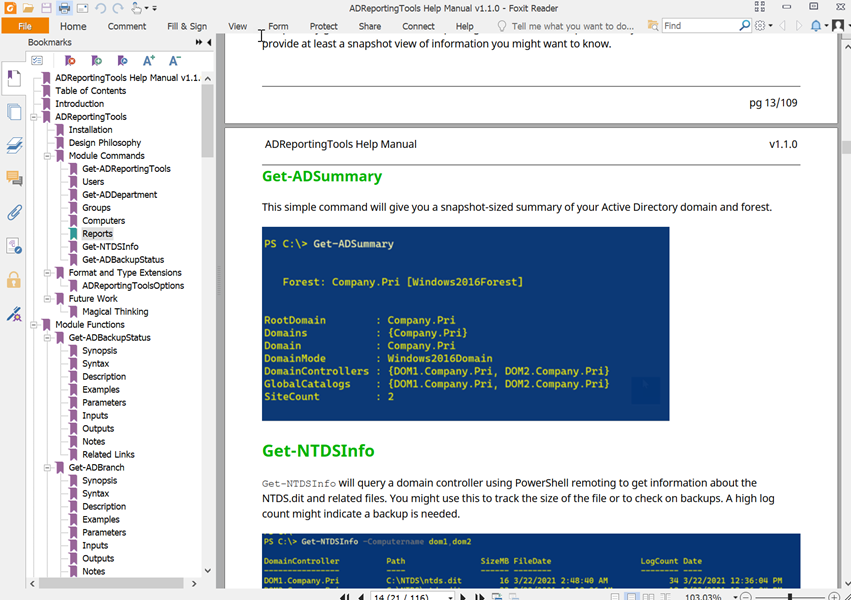

The command will launch the application associated with PDF files.

### Users


#### [Get-ADCanonicalUser](docs/Get-ADCanonicalUser.md)

Often you will find user names in the form domain\username. This command makes it easier to find the Active Directory user account using this value. If the Active Directory Recycle Bin feature is enabled, you can use the `IncludeDeletedObjects` parameter to search for the user account if it can't be found with the initial search.


#### [Get-ADUserAudit](docs/Get-ADUserAudit.md)

This command will search the Security event logs on your domain controllers for specific user-related events. These activities are not replicated, so you have to search each domain controller. Be aware that you may see related events for some actions. For example, if you create and enable a new user, you'll see multiple entries for the same event.

The output will show you the user accounts that match the search criteria, and the domain account that was responsible. Although, this command can't tell you which administrator is responsible for which activity. The best you can learn is that for a given time frame, these user accounts were managed. Or these administrators did something. You would need to search the event log on the domain controller for more information.


#### [Get-ADUserCategory](docs/Get-ADUserCategory.md)

`Get-ADUserCategory` is based on the concept of getting user information from a pre-defined category. For example, you might want to get the properties DisplayName, Name, Title, Department, and Manager for a Department category. The ADReportingTools module will define a set of pre-defined categories that you can reference through `$ADUserReportingConfiguration`.

```dos
PS C:\> $ADUserReportingConfiguration

Name         Properties
----         ----------
Department   {DisplayName, Name, Title, Department...}
Basic        {DisplayName, Name, SamAccountname, UserPrincipalName...}
Address      {DisplayName, Name, TelephoneNumber, Office...}
Organization {DisplayName, Name, Title, Department...}
Pwinfo       {DisplayName, Name, PasswordExpired, PasswordLastSet...}
```


The module ships with a JSON file that defines the categories. You can easily modify this variable to define a new category.

```powershell
$ADUserReportingConfiguration += [pscustomobject]@{Name="Custom";Properties="DisplayName","Description"}
```

Or add a property to an existing category.

```dos
PS C:\> $ADUserReportingConfiguration.where({$_.name -eq 'basic'}).foreach({$_.properties+="SID"})
PS C:\> Get-ADUserCategory gladysk -Category Basic


DistinguishedName : CN=GladysK,OU=IT,DC=Company,DC=Pri
DisplayName       : Gladys Kravitz
Name              : GladysK
SamAccountname    : GladysK
UserPrincipalName : gladysk@Company.Pri
Enabled           : True
WhenCreated       : 1/25/2021 1:32:35 PM
WhenChanged       : 3/8/2021 6:52:01 PM
SID               : S-1-5-21-493037332-564925384-1585924867-1105
```

The user's distinguished name is always included in the output.

#### [Get-ADDepartment](docs/Get-ADDepartment.md)

A related command is `Get-ADDepartment`. This command will get members of a given department. When you import the ADReportingTools module, it will define a global variable called `ADReportingHash,` which is a hashtable. The variable has a key called `Departments`. This variable is used in an argument completer for the `Department` parameter so that you can tab-complete the parameter value.

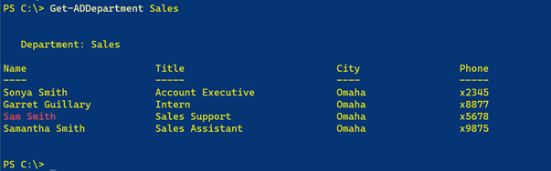

Disabled accounts will be displayed in red. Or you can use one of the custom views.

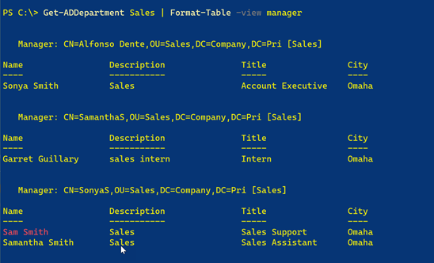

#### [Split-DistinguishedName](docs/Split-DistinguishedName.md)

This command will take an Active Directory distinguishedname and break it down into its component elements. The command does not test or verify any of the elements. It is merely parsing a text string.

```dos
PS C:\> Split-DistinguishedName "CN=Foo,OU=Bar,OU=Oz,DC=Research,DC=Globomantics,DC=com"


Name      : Foo
Branch    : Bar
BranchDN  : OU=Bar,OU=Oz,DC=Research,DC=Globomantics,DC=com
Domain    : Research
DomainDN  : DC=Research,DC=Globomantics,DC=com
DomainDNS : Research.Globomantics.com
```

### Groups


#### [Get-ADGroupUser](docs/Get-ADGroupUser.md)

The `Get-ADGroupUser` command will display all users of a given Active Directory group. The search is automatically recursive. The default output is a formatted table that will highlight disabled accounts in red. The ANSI color coding will only work in a console session.


Or you can use the default list view.


#### [Get-ADGroupReport](docs/Get-ADGroupReport.md)

`Get-ADGroupReport` will create a custom report for a group showing members. `Get-ADGroupUser` is intended to display group membership details `Get-ADGroupReport` focuses on the group, although members are also displayed. Members are always gathered recursively. You can filter for specific types of groups. You can also opt to exclude groups under CN=Users and CN=BuiltIn. The groups "Domain Users", "Domain Computers", and "Domain Guests" are always excluded from this command.


If your PowerShell hosts supports it, ANSI color schemes will be used to highlight things such as Distribution groups and disabled user accounts.

You can also use a custom table view.


Distribution groups will be shown in green and member counts of 0 in red. The Age reflects how long since the group has been modified.

### Computers


#### [Get-ADComputerReport](docs/Get-ADComputerReport.md)

`Get-ADComputerReport` will gather information about computer objects in Active Directory.

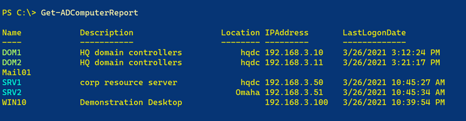

If you are running in a PowerShell console, domain controllers and member servers will be highlighted with an ANSI sequence. Disabled computer accounts will be displayed in red. The default command behavior is to find all computer objects. But you can search name or filter on a category of Server or Desktop. The filtering is based on the operating system value.

The associated formatting for this command has several named table views. You should sort on the key property first. You can try commands like this:

```powershell
Get-ADComputerReport | Sort OperatingSystem | Format-Table -view os
Get-ADComputerReport | Sort location | Format-Table -view location
Get-ADComputerReport | Sort ManagedBy | Format-Table -view managed
```

#### [Get-ADDomainControllerHealth](docs/Get-ADDomainControllerHealth.md)

`Get-ADDomainControllerHealth` is intended to give you a quick summary of the overall health of your Active Directory domain controllers. The concept of "health" is based on the following:

- How much free space remains on drive C:\?
- How much free physical memory?
- What percentage of the Security event log is in use?
- Are any critical services not running? The services checked are ntds,kdc,adws,dfs,dfsr,netlogon,samss, and w32time. Not every organization runs DNS and/or DHCP on their domain controllers, so those services have been omitted.

Output will be color-coded using ANSI escape sequences, if the PowerShell session supports it.


The domain controller services are a nested object, but if you expand them, they have a defined and formatted view.


You can use additional custom views to format the results.


### Reports


The primary goal for this module is reporting. The intention is to provide easy-to-use commands that will provide at least a snapshot view of information you might want to know.

#### [Get-ADSummary](docs/Get-ADSummary.md)

This simple command will give you a snapshot-sized summary of your Active Directory domain and forest.


#### [Get-NTDSInfo](docs/Get-NTDSInfo.md)

`Get-NTDSInfo` will query a domain controller using PowerShell remoting to get information about the NTDS.dit and related files. You might use this to track the size of the file or to check on backups. A high log count might indicate a backup is needed.

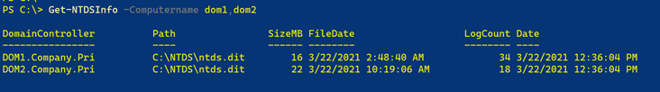

#### [Get-ADBackupStatus](docs/Get-ADBackupStatus.md)

There aren't any explicit PowerShell commands to tell if Active Directory has been backed up. One indirect approach is to use the command-line tool `repadmin.exe`. This command has a `/showbackup` parameter which will indicate when the different Active Directory partitions have been backed up. This command is a PowerShell wrapper for `repadmin.exe` that runs on the specified domain controller in a PowerShell remoting session.

If running in a console host, the date value may be shown in red, if the date is beyond the backup limit of 3 days.

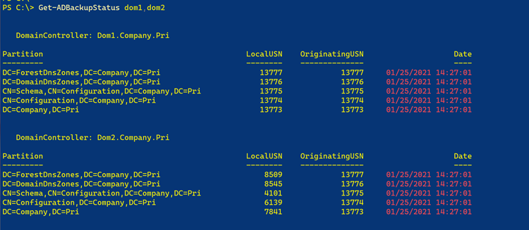

The date limit is a user-customizable value in `$ADReportingHash`.

```powershell
$ADReportinghash.BackupLimit = 5
```

If you want a limit like this all the time, in your PowerShell profile script, import the module and add this line.

The command output also has a second formatted view.

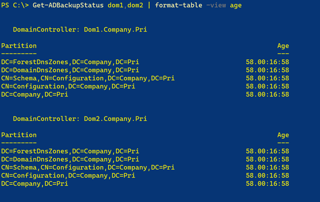

#### [Get-ADBranch](docs/Get-ADBranch.md)

`Get-ADBranch` will get all users, groups, and computers from a given Active Directory organizational unit or container and display a hierarchical report. The search is recursive from the starting search base. The output is grouped by organizational unit or container. Within each level, Active Directory objects are grouped by type, e.g. User.


**Note**: There is a formatting bug that prevents the first item from being properly grouped.

#### [Get-ADFSMO](docs/Get-ADFSMO.md)

`Get-ADFSMO` will display all FSMO role holders for the forest and domain at a glance.


#### [Get-ADSiteSummary](docs/Get-ADSiteSummary.md)

`Get-ADSiteSummary` presents a quick view of your sites and subnets.


#### [Get-ADSiteDetail](docs/Get-ADSiteDetail.md)

`Get-ADSiteDetail` will present a summary report of your Active Directory sites with a bit more detail. This command will show the site description, associated subnets, and when the site object was created and last modified. Information is displayed in a formatted table.


#### [Get-ADManager](docs/Get-ADManager.md)

In Active Directory, you can designate a manager for users and objects. From the manager account's perspective, users are designated as DirectReports, and items such as Computers, Groups, and OrganizationalUnits are referred to as ManagedObjects. `Get-ADManager` is a simple way to get a manager account and view everything that they manage. The default is to get all users and all objects, but you can filter using command parameters.

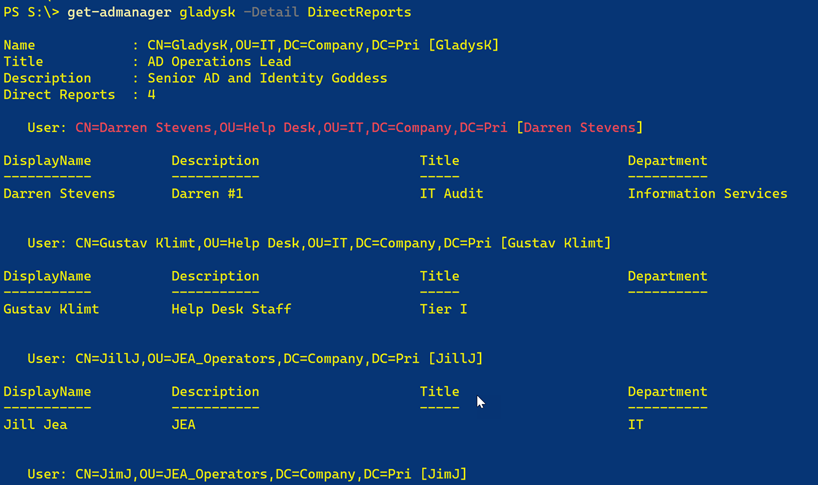

If you are running in a PowerShell console host, the default output will be colorized with ANSI escape sequences from `$ADReportingToolsOptions`. The following items will be highlighted with color

- Disabled accounts
- Domain controller names
- Member server names
- Universal group scope
- DomainLocal group scope
- Distribution group category

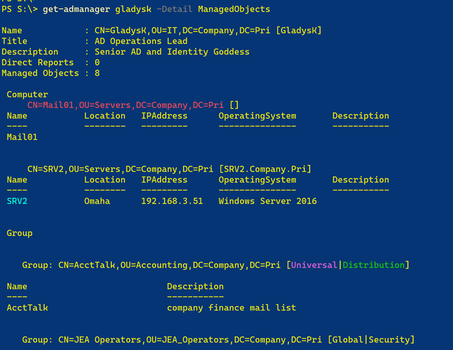

#### [Show-DomainTree](docs/Show-DomainTree.md)

`Show-DomainTree` will display your domain in a tree view at the console. By default, the function will use color-coded ANSI formatting, assuming your PowerShell console supports it. The default display uses the organizational unit names. Although, you can use the distinguishedname of each branch. If you use -Containers, containers like Users will be included.


#### [New-ADDomainReport](docs/New-ADDomainReport.md)

`New-ADDomainReport` will create an HTML report of your domain. The report layout is by container and organizational unit. Underneath each branch will be a table display of users, computers, and groups. Beneath each group will be a table of recursive group members. You should get detail about users and computers if you hover the mouse over the distinguished name. The report includes javascript to enable collapsible regions.


The ADReportingTools module includes a CSS file, which will be used by default. But you can specify an alternate CSS file. If you want to make the file portable, you can opt to embed the CSS into the HTML file. You can only embed from a file, not a URL reference.

The module's CSS file can be found in the [reports](reports/domainreport.css) folder. You can view a complete sample report [here](reports/sampledomain.html).

#### [New-ADChangeReport](docs/New-ADChangeReport.md)

`New-ADChangeReport` will create an HTML report showing changes to Active Directory users, computers, and groups since a given date and time. The command uses `Get-ADObject` to query the `WhenChanged` property. The objects are organized by class and/or container and written to an HTML file. The command uses a CSS file from the ADReportingTools module, although you can specify your own. To make the HTML file portable, you can opt to embed the CSS content from a file source.

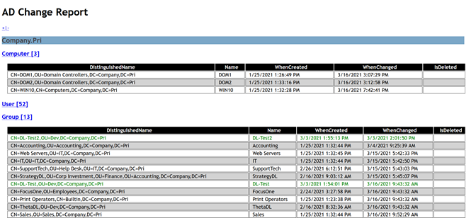

You can view the default CSS file [here](reports/changereport.css). A complete sample report can be found [here](reports/samplechange.html).

#### [New-ADGroupReport](docs/New-ADGroupReport.md)

`New-ADGroupReport` will create an HTML report of specified groups from Active Directory. This function is based on `Get-ADGroupReport` and converts the output to an HTML file. You can specify a CSS file or use the default from the module.

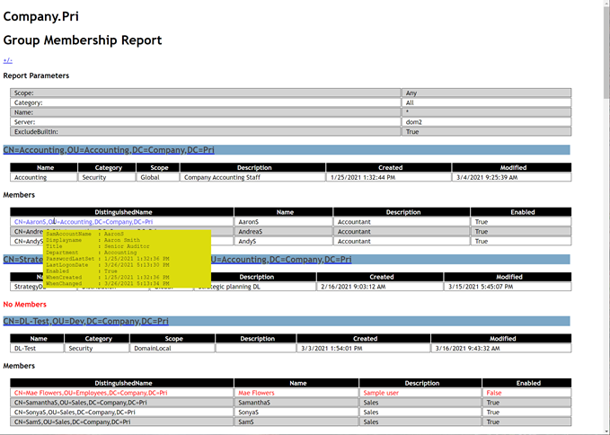

Disabled user accounts will be highlighted in red when using the default CSS file from the module. User detail will pop-up when the mouse hovers over the user's distinguishedname.

A complete sample report can be found [here](reports/samplegroup.html).

## Formats, Type Extensions, and Other Features

The module includes format and type extensions to simplify using the commands in the Active Directory module. The extensions are automatically imported into your PowerShell session when you import the ADReportingTools module.

Currently, only AD User objects have been extended.

|Name | Type |  Value |
|----  | ---- | ----- |
|LastName |  AliasProperty | Surname|
|DN     |  AliasProperty | DistinguishedName|
|FirstName | AliasProperty | GivenName |
|UPN       | AliasProperty | UserPrincipalName|

These extensions have been grouped as a property set called *Names*.

```dos
PS C:\>Get-ADUser artd | Select-Object Names

DN             : CN=ArtD,OU=IT,DC=Company,DC=Pri
Name           : ArtD
FirstName      : Art
LastName       : Deco
SamAccountName : ArtD
UPN            : artd@company.com
```

Or use a defined view for Active Directory user objects.

```powershell
Get-ADUser -SearchBase "ou=employees,dc=company,dc=pri" -filter * |
Format-Table -view names
```


The module adds a default table view for AD group objects.

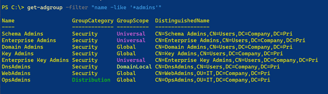

If your PowerShell console supports it, Distribution, Universal, and DomainLocal groups will be highlighted in color.

### ADReportingToolsOptions

The ANSI sequences used in the format files are user-configurable. Values are stored in an exported variable called `ADReportingToolsOptions`, although you shouldn't try to access the variable directly. Use `Get-ADReportingToolsOptions` to see the current values.

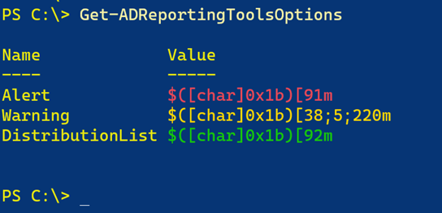

The module uses the `[char]0x1b` escape sequence because it works in both Windows PowerShell and PowerShell 7.x.

If you prefer to customize the sequence, use `Set-ADReportingToolsOptions`.

```powershell
Set-ADReportingToolsOptions DistributionList -ANSI "$([char]0x1b)[38;5;50m"
```

This change is only for the duration of your PowerShell session. Add the command to a PowerShell profile script to make it more permanent.

 If you would like to see what ANSI sequences look like, install the [PSScriptTools](https://github.com/jdhitsolutions/PSScriptTools/blob/master/README.md) module from the PowerShell Gallery and use [Show-ANSISequence](https://github.com/jdhitsolutions/PSScriptTools/blob/master/docs/Show-ANSISequence.md).

### ADReportingHash

Several module configuration details are storing in a hashtable called `$ADReportingHash`. Here's a sample.

```powershell
Name                           Value
----                           -----
Handle                         System.Management.Automation.PowerShellAsyncResult
Note                           This hashtable is used by the ADReportingTools module. Do not delete.
BackupLimit                    3
Departments                    {Accounting, Consumer Affairs, Customer Service, Dev...}
LastUpdated                    3/29/2021 5:54:23 PM
DomainControllers              {DOM1.Company.Pri, DOM2.Company.Pri}
```

Some of these items, such as the list of Departments and Domain Controllers, are gathered when you import the module. On import, a background runspace is invoked that uses a synchronized hashtable to surface information to your session.

### Argument Completers

One way the data from `$ADReportingHash` is used is as argument completers. The `Department` parameter from `Get-ADDepartment`is one example. Of course, you need to wait until the background runspace is complete before this will give you any values.

All commands in this module, as well as the Get commands from the Active Directory module, that have a `Server` parameter, will use the DomainController list as argument completers. Note that the domain controller names are stored in their DNS format.

### CSS Files

The HTML report commands rely on CSS for formatting. In some cases, CSS is defined in the function and embedded into the HTML file. Other CSS is imported from sample files in the Reports directory of this module. If you would like to define your own CSS, it is recommended you use the samples as templates for your own work. You might also need to view the source code of specific functions to see what style settings are being defined.

You are always welcome to create your own function or script based on code from this module.

## Future Work

These are items under consideration and likely to be added to the module:

- Get-ADPasswordPending (look at Get-ADUserResultantPasswordPolicy).
- An HTML computer report.
- Enhanced output from `Search-ADAccount`. This might be several commands.
- Add logo support to the HTML reporting functions.
- Get items by site or location.
- Get newest created item(s) created since a given date.

These are items that I'm dreaming about and may add at some point in the future:

- A toolset to build HTML reports on the fly based on default formatting.
- A WPF-based OU browser or a simplified version of ADUC.
- A WPF-based password reporting tool.

I welcome suggestions, feedback, and comments in the module repository's [Discussion](https://github.com/jdhitsolutions/ADReportingTools/discussions) section.

last updated *2021-04-07 12:23:19Z*
